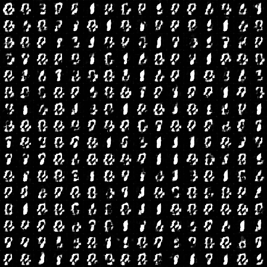
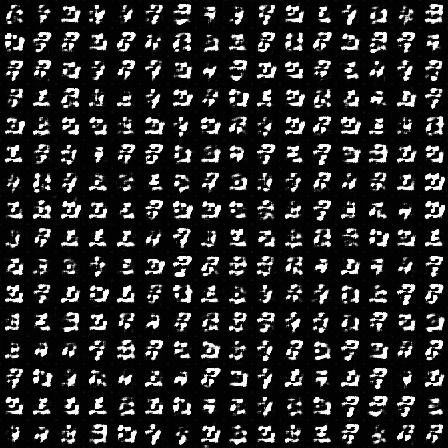

# Mnist DCGAN

### Small project of generating mnist image using DCGAN

We mainly followed the original DCGAN paper [Unsupervised Representation Learning with Deep Convolutional Generative Adversarial Networks.](https://arxiv.org/abs/1511.06434)

## Usage

1. Run ```train.py```. It will automatically download mnist dataset and proceed training.

2. ```train.py``` will automatically make ```img``` folder, and store GAN generated images.

## Result

We present some examples generated by DCGAN.

 &emsp; 
